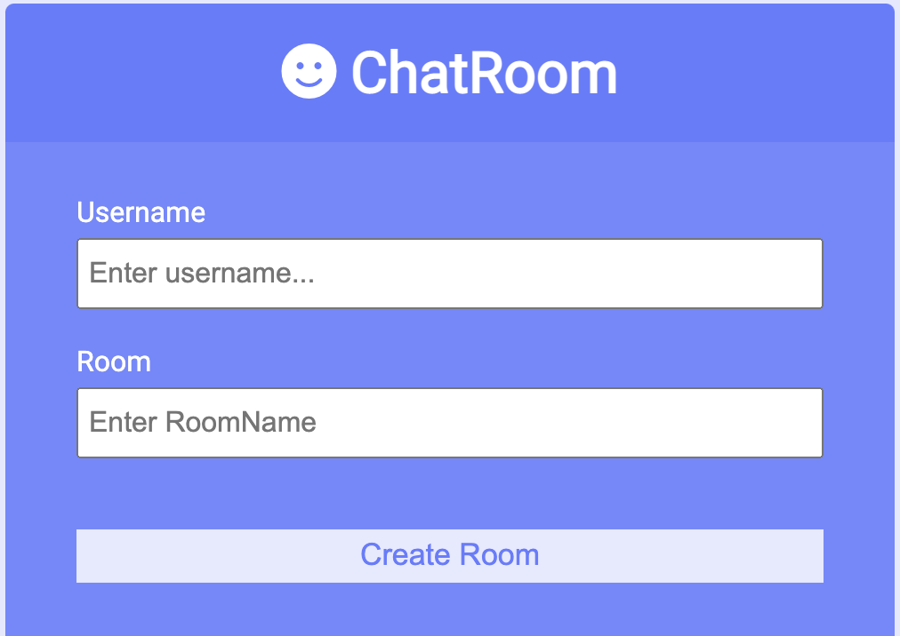
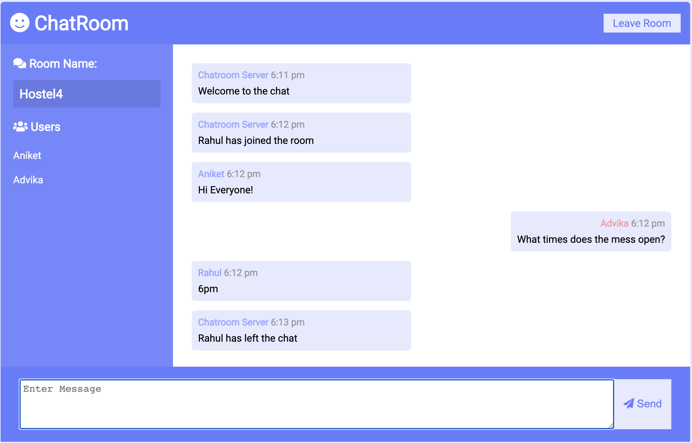

# chat-room
Chat room to have secret chats .
This is built using socket.io and express js. 

The server notifies the room of the users that have joined, also notifies the room about the users that have left
Users can chat in real time, there is no storage to serve purpose of being stateless.

# Create Room
 
 

# Chat Interface

